# Đồ án môn học: Phần mềm quản lý & đăng ký học phần trực tuyến

## Giới thiệu phần mềm 
Phần mềm quản lý và đăng ký học phần trực tuyến do nhóm SV của khoa Tin học trường DHSP Đà nẵng phát triển và dưới sự hướng dẫn của TS Giảng viên Trần Văn Hưng.

Phần mềm được tách làm 2 phần riêng biệt 
* Phần api Service được xây dựng trên nền tảng Golang, GraphQL, postgresql
* Phần Web App được làm trên framework React JS.

Demo: https://ued.tabvn.com

Code: https://github.com/tabvn/ued_danang
## 2. Chức năng người dùng 
Phần mềm gồm có 3 loại users đó là 
* Role dành cho quản trị viên
    * Quản lý quản trị viên
    * Quản lý khoa 
    * Quản lý sinh viên
    * Quản lý học phần, môn học 
    * Quản lý danh sách đăng ký học phần (danh sách sinh viên đã đăng ký học phần)
    * Quản lý bảng điểm của toàn học phần.
    
* Role dành cho giảng viên
    *  Xem danh sách sinh viên chủ nhiệm
    * danh sách sinh viên đăng ký học học phần mà mình giảng dạy
    * Quản lý điểm của sinh viên đăng ký học phần mình giảng dạy
* Role dành cho sinh viên
    * Đăng ký học phần đang mở
    * Sửa đổi thông tin cá nhân
    * Xem điểm(kết quả) học tập

## 3. Quản trị viên
### 3.1 Quản lý Khoa
Danh sách các khoa


Thêm mới khoa


### 3.2 Quản lý giảng viên

Danh sách giảng viên
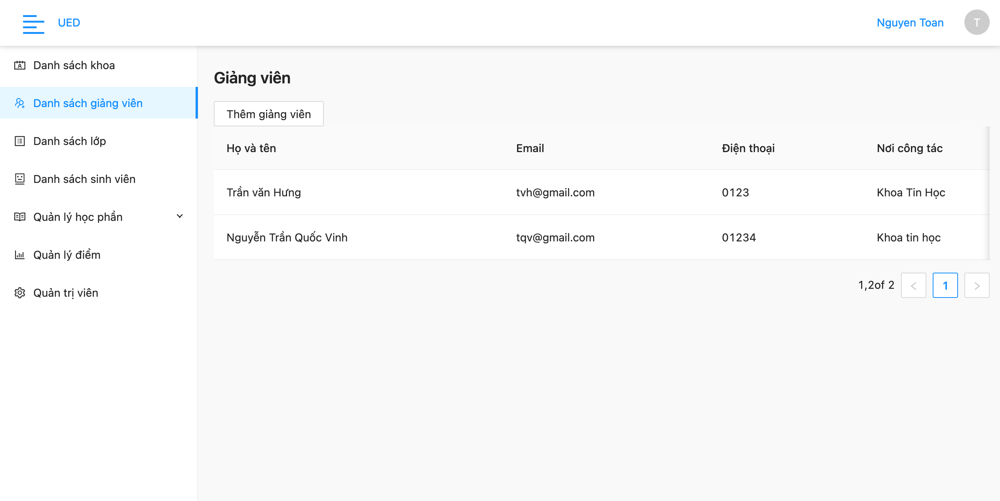

Thêm mới giảng viên


### 3.3 Quản lý lớp sinh hoạt

Danh sách lớp học


Thêm mới lớp học


### 3.4 Quản lý lớp sinh viên

Danh sách sinh viên


Thêm mới sinh viên


### 3.4 Quản lý học phần

Danh sách học phần đang mở


Mở học phần mới


Quản lý danh sách đã đăng ký theo từng học phần, có thể tải về danh sách.


### 3.3 Quản lý điểm

Quản lý điểm theo từng học phần, cấu hình hệ số điểm (tốii đa 4 hệ số điểm)
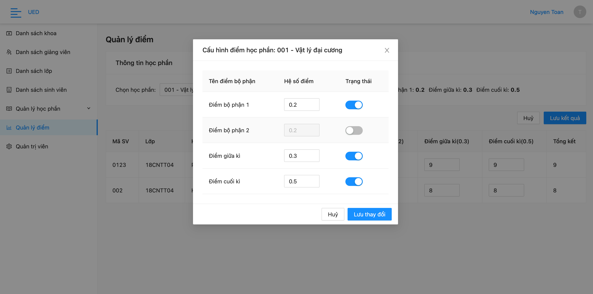

Nhập điểm cho sinh viên, và lưu kết quả học tập.


### 3.4 Quản lý quản trị viên


## 4 Giảng viên

Xem danh sách sinh viên theo từng học phần mà mình giảng dạy.

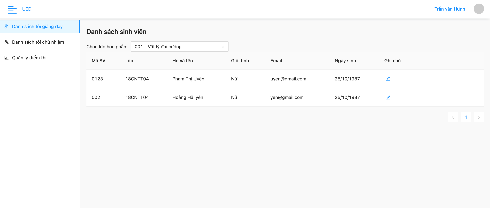

Ghi chú lại những sinh viên trong quá trình học (vd: đi học đều, có sáng tạo tốt...)

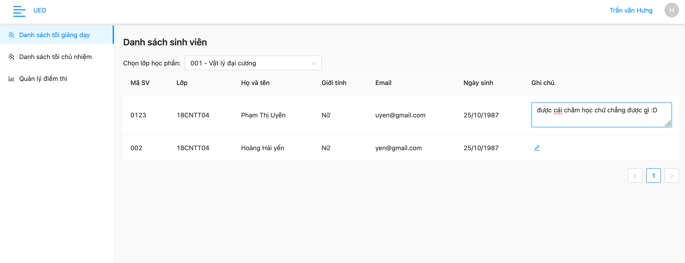

Xem danh sách sinh viên mà giảng viên đó chủ nhiệm.

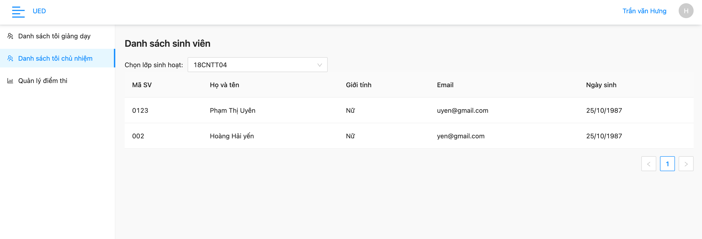

Giảng viên cũng có thể quản lý và cấu hình điểm cho môn học mình giảng dạy (Như quyền quản trị viên, tuy nhiên chỉ cho phép với môn học mà giảng viên đó giảng dạy)

Ưu điểm: quá trình thay đổi cấu hình hệ số bảng điểm không làm mất đi kết quả học tập đã nhập trước đó!

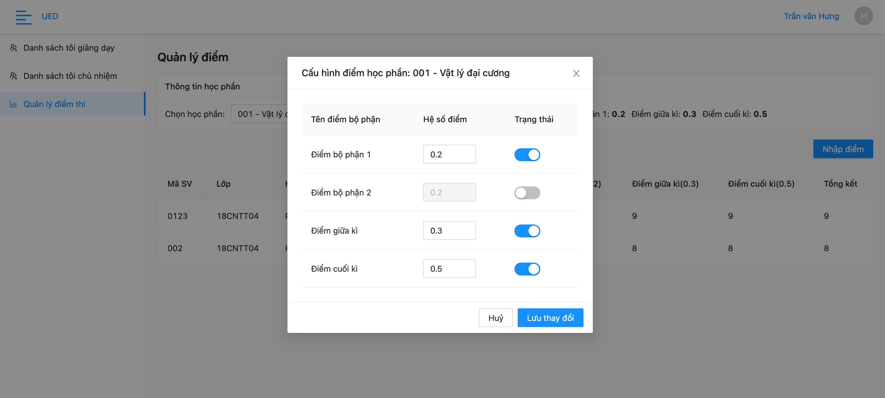

Tiến hành nhập kết quả học tập cho sinh viên

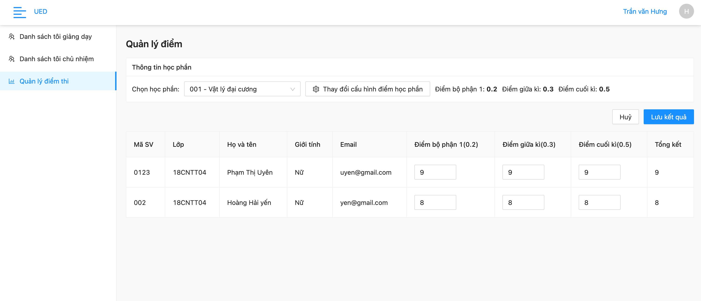

## 5 Sinh viên

Đăng nhập vào hệ thống

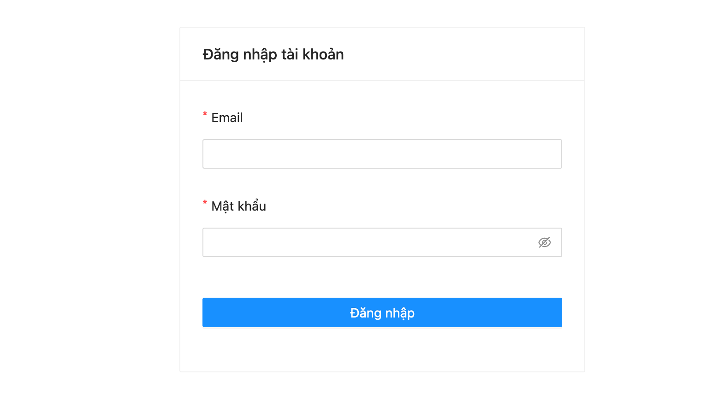

Xem học phần đang mở và đăng ký

ưu điểm:
* Hệ thống có báo trùng lịch 
* Hệ thống có báo lỗi nếu số lượng đăng ký vượt tối đa cho phép.
* Sẽ không được huỷ đăng ký nếu đã bị khoá thông qua quản trị viên.

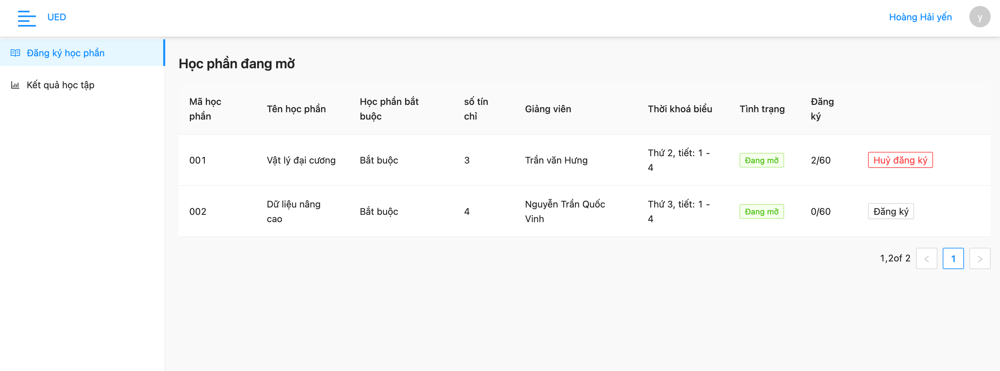

Xem kết quả học tập

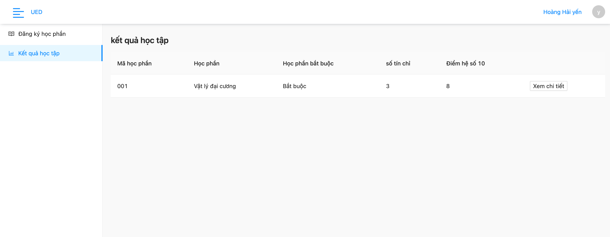

Xem chi tiết kết quả điểm các cột bộ phận

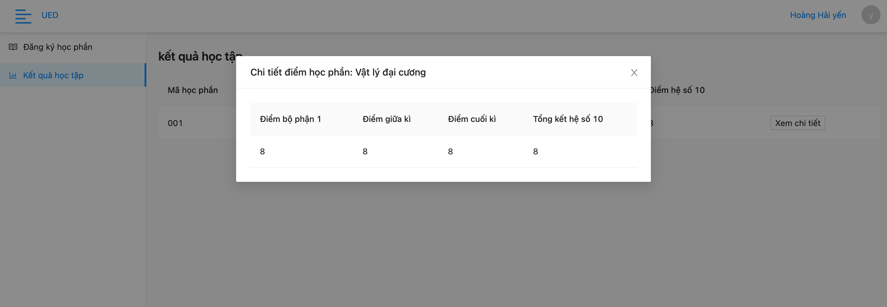


## 5 Cài đặt lên Google Cloud platform
Đăng nhập vào trang quản lý của google cloud platform theo đường dẫn sau
https://console.cloud.google.com/compute/instances
chọn tên dự án và tiến hành tạo 1 cloud computer instance (đây chính là khái niệm tạo mới 1 server ảo trên google cloud computer)


### 5.1 Tạo Server
Tiến hành tạo coputer instance với thông số cần thiết, như cấu hình CPU,RAM.
Lưu ý chon khu vực computer là rất quan trọng, Nên chọn khu vực gần với lượng users nhiều nhất, ví dụ ở Vietnam thì mình nên chọn asia-southeast1 server này sẽ nằm ở Singapore.

Sau khi tạo xong thì sẽ có thông tin của server như API. và ta có thể login vào server để cài đặt

ta có thể trỏ luôn tên miền về server này

### 5.2 Login Vào server dùng SSH 

```
gcloud beta compute ssh --zone "asia-southeast1-b" "instance-1" --project "danang-288409"
```

### 5.3 Cài Docker cho server 

```
curl -fsSL https://get.docker.com -o get-docker.sh
sudo sh get-docker.sh
```

### 5.4 Deploy API service

Vào thự mục ued thay đổi cấu hình thông tin phù hợp với server của bạn trong file ./deploy.sh

``` 
./deploy.sh
```


## 6 Deploy Web App

vào thư mục web (Buidl và deploy)

```
 npp npm bnd 
```


Mặc định đăng nhập với tài khoản 
email: admin@gmail.com 
password: admin


