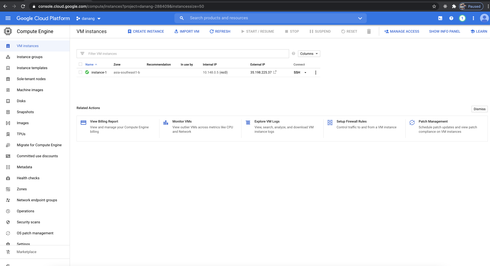

# Đồ án môn học: Phần mềm quản lý & đăng ký học phần trực tuyến

## Cài đặt lên Google Cloud platform
Đăng nhập vào trang quản lý của google cloud platform theo đường dẫn sau
https://console.cloud.google.com/compute/instances
chọn tên dự án và tiến hành tạo 1 cloud computer instance (đây chính là khái niệm tạo mới 1 server ảo trên google cloud computer)


### Tạo Server
Tiến hành tạo coputer instance với thông số cần thiết, như cấu hình CPU,RAM.
Lưu ý chon khu vực computer là rất quan trọng, Nên chọn khu vực gần với lượng users nhiều nhất, ví dụ ở Vietnam thì mình nên chọn asia-southeast1 server này sẽ nằm ở Singapore.

Sau khi tạo xong thì sẽ có thông tin của server như API. và ta có thể login vào server để cài đặt

ta có thể trỏ luôn tên miền về server này

### Login Vào server dùng SSH 

```
gcloud beta compute ssh --zone "asia-southeast1-b" "instance-1" --project "danang-288409"
```

### Cài Docker cho server 

```
curl -fsSL https://get.docker.com -o get-docker.sh
sudo sh get-docker.sh
```

### Deploy API service

Vào thự mục ued thay đổi cấu hình thông tin phù hợp với server của bạn trong file ./deploy.sh

``` 
./deploy.sh
```


## Deploy Web App

vào thư mục web (Buidl và deploy)

```
 npp npm bnd 
```


Mặc định đăng nhập với tài khoản 
email: admin@gmail.com 
password: admin
